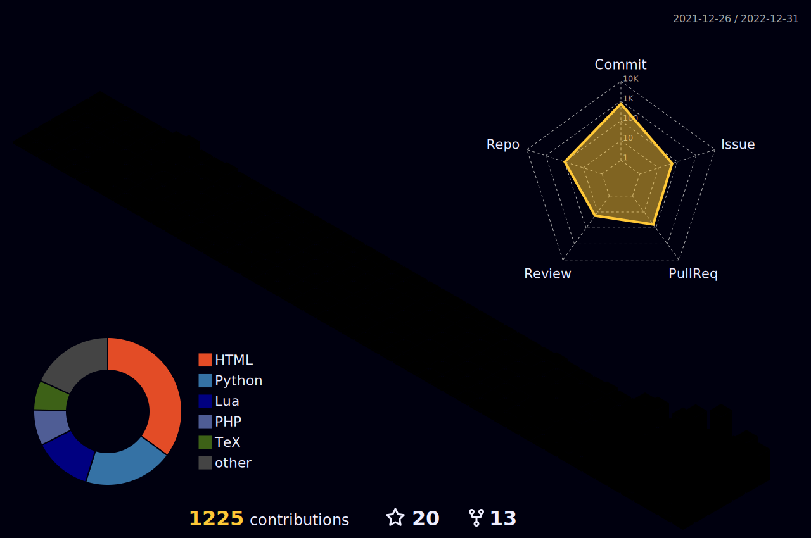
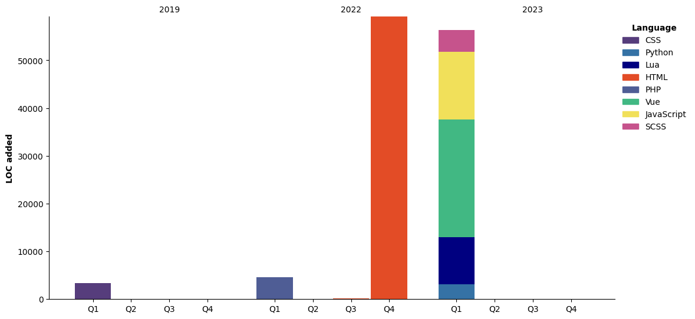

<table style="border-color: transparent;" cellspacing=0 ><tr><td valign="top" width="60%">
  
🐱‍🏍**Artificial Intelligence** 

> _你好，我是一名AI专业的大学生，很高兴认识你。_

There’s going to be something more academic and something that fascinates me. 
I have always had an absurd idea-composing music in a programming language and programming in a music language([~~Maybe we can really try for it~~](https://github.com/academic-jyunko)).

🐱‍💻**Music Theories**
> _在这世界上我喜欢的东西并不是很多，我会写点[小曲儿](https://fm.jyunko.cn)，也会很自豪的和你说我想做个[诗人](https://www.zgshige.com/c/2022-07-25/22158479.shtml)，我喜欢雪花。_

I don't really like most things in this world, but I write [some tiny songs](https://fm.jyunko.cn), and I wanna to be [a poet](https://www.zgshige.com/c/2022-07-25/22158479.shtml)... By the way, I like snowflakes ❄️. 
  
🐱‍👤**Currently**  

> _我正在编写自己的机器学习与跨平台机器人[框架](https://github.com/retrofor/IamAI/) ，如果你对此感兴趣可以给我发送[邮件](mailto:admin@jyunko.cn)。_    +   = 

I am contributing to the [IamAI](https://github.com/retrofor/IamAI/)  and associated projects. If you are interested abou it, just [via me an email](mailto:admin@jyunko.cn). 
</td><td valign="top" width="33%">
<p align="right">

### 📕My Diaries :s
> 在琴谱上，我们学会了理论，但是跟别人相处之后，才理解了音乐。
<!-- diary starts -->
<details open="true"><summary>2023-02-18</summary><li><a href="https://diary.jyunko.cn/2023/02/18/Sat">《308 - 2023.02.18》</a></li></details>

<details open="true"><summary>2023-02-18</summary><li><a href="https://diary.jyunko.cn/2023/02/18/Test">《308 - 2023.02.18 Test》</a></li></details>

<details open="true"><summary>2023-02-16</summary><li><a href="https://diary.jyunko.cn/2023/02/16/Thu">《308 - 2023.02.16》</a></li></details>

<details open="true"><summary>2023-01-31</summary><li><a href="https://diary.jyunko.cn/2023/01/31/QY-dairy">《白秋日记（2023.01.31~2023.12.31）》</a></li></details>

<details open="true"><summary>2021-12-26</summary><li><a href="https://diary.jyunko.cn/2021/12/26/Sun">《2020.12.6~2021.12.6 - 2021.12.26》</a></li></details>
<!-- diary ends -->

_More on [diary.jyunko.cn](https://diary.jyunko.cn)_ or 
_you can join [us](https://github.com/Diaries-Store)_
</p>
</td></tr></table>

<table style="border-color: transparent;" cellspacing=0 ><tr><td valign="top" width="10%">
  
<!--START_SECTION:waka-->


**I'm a Night 🦉** 

```text
🌞 Morning                622 commits         ████░░░░░░░░░░░░░░░░░░░░░   17.54 % 
🌆 Daytime                1067 commits        ████████░░░░░░░░░░░░░░░░░   30.08 % 
🌃 Evening                830 commits         ██████░░░░░░░░░░░░░░░░░░░   23.40 % 
🌙 Night                  1028 commits        ███████░░░░░░░░░░░░░░░░░░   28.98 % 
```
📅 **I'm Most Productive on Monday** 

```text
Monday                   652 commits         █████░░░░░░░░░░░░░░░░░░░░   18.38 % 
Tuesday                  457 commits         ███░░░░░░░░░░░░░░░░░░░░░░   12.88 % 
Wednesday                498 commits         ████░░░░░░░░░░░░░░░░░░░░░   14.04 % 
Thursday                 487 commits         ███░░░░░░░░░░░░░░░░░░░░░░   13.73 % 
Friday                   373 commits         ███░░░░░░░░░░░░░░░░░░░░░░   10.52 % 
Saturday                 533 commits         ████░░░░░░░░░░░░░░░░░░░░░   15.03 % 
Sunday                   547 commits         ████░░░░░░░░░░░░░░░░░░░░░   15.42 % 
```


<!--END_SECTION:waka-->
  > _✨你应该能够很轻而易举的在晚上(尤其是周日晚至周一凌晨)找到我。_
  
  ✨Catch me night only, especially between the Sun. evening to the Mon. early morning. 
</td><td valign="top" width="33%">
<p align="right">


  ***
  
  > 人类对科技，一比零 :s
  
  ***
  

    
  ***
  
  > Human Vs. AI (1:0) :s
  
  ***
  
</p>
</td></tr></table>

<table><tr><td valign="top" width="33%">
  
### 🏷Recent releases
<!-- recent_releases starts -->
[retrofor.github.io v2023.0.4 🌈](https://github.com/retrofor/retrofor.github.io/releases/tag/v2023.0.4) - 2023-02-28

[OlivaGithub v3.1415 🐱‍👤](https://github.com/HsiangNianian/OlivaGithub/releases/tag/v3.1415) - 2023-02-28

[iamai v3.1 🌈](https://github.com/retrofor/iamai/releases/tag/v3.1) - 2023-02-20

[flarum-post-formatter v0.0.4✨](https://github.com/HsiangNianian/flarum-post-formatter/releases/tag/v0.0.4) - 2023-02-17

[OlivaBiliLive v3](https://github.com/HsiangNianian/OlivaBiliLive/releases/tag/untagged-8bf4ca6c48e6c3164a42) - 2023-02-12

[retro_pkg_test v3.1415 🌈](https://github.com/retrofor/retro_pkg_test/releases/tag/v3.1415) - 2023-02-01

[Oliva_Plugin_GPT release-v0.1.0](https://github.com/retrofor/Oliva_Plugin_GPT/releases/tag/v0.1.0) - 2023-01-24

[OlivaSubHlp v3](https://github.com/HsiangNianian/OlivaSubHlp/releases/tag/3) - 2023-01-22
<!-- recent_releases ends -->

_More [recent releases](https://github.com/HsiangNianian/HsiangNianian/blob/main/releases.md)_
</td><td valign="top" width="33%">

### 📰Academic site
<!-- blog starts -->
<details><summary>2023-02-20 <a href="https://academic.jyunko.cn/2023/02/20/The-Pain-of-AI-2">The Pain of AI II</a></summary><p>???</p></details>

<details><summary>2023-01-18 <a href="https://academic.jyunko.cn/2023/01/18/Training-an-acoustic-model-for-CMUSphinx-zh-CN">训练自己的声学模型</a></summary><p>声学模型主要用于计算语音特征和每个发音模板之间的似然度。目的是为每个声学单元建立一套模型参数（通过不断地学习和改进得到最优的，也就是概率最大的一组HMM模型参数）。</p></details>

<details><summary>2023-01-11 <a href="https://academic.jyunko.cn/2023/01/11/Training-an-acoustic-model-for-CMUSphinx-en">Training an acoustic model for CMUSphinx</a></summary><p>An article explaining how to train one's own acoustic model in CMUSphinx speech recognition project</p></details>

<details><summary>2023-01-10 <a href="https://academic.jyunko.cn/2023/01/10/ASR-Detection-System-of-Sensitive-Words-Based-on-MFSC-Algorithm">ASR Detection System of Sensitive Words Based on MFSC Algorithm</a></summary><p>基于MFSC算法的ASR检测敏感词系统， 此页面为未来paper与软著的提交页面。</p></details>

<details><summary>2023-01-10 <a href="https://academic.jyunko.cn/2023/01/10/GPT-3-vs-Rasa-chatbots">GPT-3 vs. Rasa chatbots</a></summary><p>Richard Trevithick’s locomotive — the GPT-3 of the early 19th century (Shutterstock.com)</p></details>

<details><summary>2023-01-09 <a href="https://academic.jyunko.cn/2023/01/09/The-Pain-of-AI">The Pain of AI</a></summary><p>???</p></details>
<!-- blog ends -->

_More on [academic.jyunko.cn](https://academic.jyunko.cn/)_
</td><td valign="top" width="33%">

### 🎹Release Album/EP
<!-- fm starts -->
<details open="true"><summary>2021-10-23 Fragments</summary><li><a href="https://fm.jyunko.cn/Fragments">Fragments (断章 - 断篇)</a></li></details>

<details open="true"><summary>2021-05-22 #will u?</summary><li><a href="https://fm.jyunko.cn/So-was-your-heart">So was your heart?</a></li></details>

<details open="true"><summary>2021-01-23 IANHIA fireworks(rework)</summary><li><a href="https://fm.jyunko.cn/paink">Pain,K(special day work)</a></li></details>

<details open="true"><summary>2020-12-15 CAUSEKNOT (Special Collection - 2021&winter)</summary><li><a href="https://fm.jyunko.cn/winter">温存，琴弦之所以断了的理由</a></li></details>

<details open="true"><summary>2020-09-25 Decades</summary><li><a href="https://fm.jyunko.cn/Decades">Decades;2020~2019</a></li></details>

<details open="true"><summary>2020-01-19 Cardioid (心脏线)</summary><li><a href="https://fm.jyunko.cn/Cardioid">¡ ƒ=(1-sinθ) ! (心脏线)</a></li></details>
<!-- fm ends -->
  
_More on [fm.jyunko.cn](https://fm.jyunko.cn/)_
</td></tr></table>

<p align="right">Welcome to <a href="https://twitter.com/HsiangNianian">follow @HsiangNianian on Twitter<a></p>
