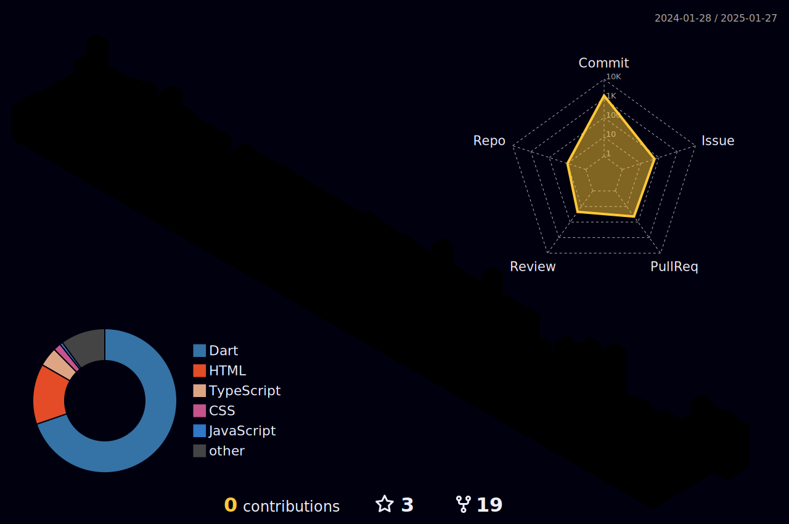

<table style="border-color: transparent;" cellspacing=0 >
<tr><td valign="center" width="60%">

**Blacklist developers and projects (黑名单)**
  
> 我的开发者黑名单，谨以这个告示板告诉同类圈子内的开发者提防此类读书甚少不太懂事的人。
  
  * [Akirami](https://github.com/A-Kirami)、[Nyuan Zhang](https://github.com/blueglassblock)、[A60](https://github.com/djkcyl)、[Bryan不可思议](https://github.com/ProgramRipper)、[Tarrailt](https://github.com/RF-Tar-Railt)
  原因: 2023年4月4日对测试环境的*恶意攻击*[^1]行为，事后竟也不会感到丝毫羞耻😅。
  
  [^1]: https://academic.jyunko.cn/2023/04/04/April-Fours-Day
  
</td></tr></table>

<br>

<table style="border-color: transparent;" cellspacing=0 ><tr><td valign="center" width="60%">
  
🐱‍🏍**Artificial Intelligence** 

> _你好，我是一名AI专业的大学生，很高兴认识你。_

There’s going to be something more academic and something that fascinates me. 
I have always had an absurd idea-composing music in a programming language and programming in a music language([~~Maybe we can really try for it~~](https://github.com/academic-jyunko)).

🐱‍💻**Music Theories**
> _在这世界上我喜欢的东西并不是很多，但是平时我会写点[小曲儿](https://fm.jyunko.cn)，也会很自豪的和你说我想做个[诗人](https://www.zgshige.com/c/2022-07-25/22158479.shtml)，除此之外我唯一喜欢的可能就是雪花了。_

I don't really like most things in this world, but I write [some tiny songs](https://fm.jyunko.cn), and I wanna to be [a poet](https://www.zgshige.com/c/2022-07-25/22158479.shtml)... By the way, I like snowflakes ❄️. 
  
🐱‍👤**Currently**  

> _我正在编写自己的机器学习[框架](https://github.com/retrofor/) ，如果你对此感兴趣可以给我发送[邮件](mailto:i@jyunko.cn)。_    +   = 

I am contributing to the [retrofor](https://github.com/retrofor/)  and associated projects. If you are interested abou it, just [via me an email](mailto:i@jyunko.cn). 
</td><td valign="top" width="33%">
<p align="right">

### 📕My Diaries :s
> 在琴谱上，我们学会了理论，但是跟别人相处之后，才理解了音乐。
<!-- diary starts -->
<details open="true"><summary>2023-03-13</summary><li><a href="https://diary.jyunko.cn/2023/03/13/Mon">《余言后续》</a></li></details>

<details open="true"><summary>2023-02-18</summary><li><a href="https://diary.jyunko.cn/2023/02/18/Sat">《308 - 2023.02.18》</a></li></details>

<details open="true"><summary>2023-02-18</summary><li><a href="https://diary.jyunko.cn/2023/02/18/Test">《308 - 2023.02.18 Test》</a></li></details>

<details open="true"><summary>2023-02-16</summary><li><a href="https://diary.jyunko.cn/2023/02/16/Thu">《308 - 2023.02.16》</a></li></details>

<details open="true"><summary>2023-01-31</summary><li><a href="https://diary.jyunko.cn/2023/01/31/QY-dairy">《白秋日记（2023.01.31~2023.12.31）》</a></li></details>
<!-- diary ends -->

_More on [diary.jyunko.cn](https://diary.jyunko.cn)_ or 
_you can join [us](https://github.com/Diaries-Store)_
</p>
</td></tr></table>

<table style="border-color: transparent;" cellspacing=0 ><tr><td valign="top" width="10%">
  
<!--START_SECTION:waka-->


**I'm a Night 🦉** 

```text
🌞 Morning                2259 commits        ████░░░░░░░░░░░░░░░░░░░░░   15.53 % 
🌆 Daytime                4328 commits        ███████░░░░░░░░░░░░░░░░░░   29.75 % 
🌃 Evening                3619 commits        ██████░░░░░░░░░░░░░░░░░░░   24.87 % 
🌙 Night                  4344 commits        ███████░░░░░░░░░░░░░░░░░░   29.86 % 
```
📅 **I'm Most Productive on Friday** 

```text
Monday                   1966 commits        ███░░░░░░░░░░░░░░░░░░░░░░   13.51 % 
Tuesday                  2001 commits        ███░░░░░░░░░░░░░░░░░░░░░░   13.75 % 
Wednesday                2538 commits        ████░░░░░░░░░░░░░░░░░░░░░   17.44 % 
Thursday                 1635 commits        ███░░░░░░░░░░░░░░░░░░░░░░   11.24 % 
Friday                   2550 commits        ████░░░░░░░░░░░░░░░░░░░░░   17.53 % 
Saturday                 1738 commits        ███░░░░░░░░░░░░░░░░░░░░░░   11.95 % 
Sunday                   2122 commits        ████░░░░░░░░░░░░░░░░░░░░░   14.58 % 
```


<!--END_SECTION:waka-->
  > _✨你应该能够很轻而易举的在晚上(尤其是周日晚至周一凌晨)找到我。_
  
  ✨Catch me night only, especially between the Sun. evening to the Mon. early morning. 
</td><td valign="top" width="33%">
<p align="right">

  ***
  
  > 人类对科技，一比零 :s
  
  ***
  


  ***
  
  > Human Vs. AI (1:0) :s
  
  ***
  
</p>
</td></tr></table>

<table><tr><td valign="top" width="33%">
  
### 🏷Recent releases
<!-- recent_releases starts -->
[OlivaXXX v3.1](https://github.com/HsiangNianian/OlivaXXX/releases/tag/untagged-bb5cc9321f51c59ca7c1) - Near Future

[OlivaBiliLive release-v3.14.1](https://github.com/HsiangNianian/OlivaBiliLive/releases/tag/untagged-f4ec52c28bb501b84e5d) - Near Future

[BlackJack v0.1.0](https://github.com/HsiangNianian/BlackJack/releases/tag/untagged-7556df0546fbf278b86e) - Near Future

[iamai v3.2.3](https://github.com/retrofor/iamai/releases/tag/v3.2.3) - 2023-07-29

[flarum-post-formatter v0.0.5✨](https://github.com/HsiangNianian/flarum-post-formatter/releases/tag/v0.0.5) - 2023-05-19

[unpredictableFate v1.0.0 🎉](https://github.com/HsiangNianian/unpredictableFate/releases/tag/v1.0.0) - 2023-04-15

[Flexirobo v1.0.0.post1 🎉](https://github.com/retrofor/Flexirobo/releases/tag/v1.0.0.post1) - 2023-04-11

[Crossplatform-pack v0.0.1✨](https://github.com/HsiangNianian/Crossplatform-pack/releases/tag/v0.0.1) - 2023-04-10
<!-- recent_releases ends -->

_More [recent releases](https://github.com/HsiangNianian/HsiangNianian/blob/main/releases.md)_
</td><td valign="top" width="33%">

### 📰Academic site
<!-- blog starts -->

<!-- blog ends -->

_More on [academic.jyunko.cn](https://academic.jyunko.cn/)_
</td><td valign="top" width="33%">

### 🎹Release Album/EP
<!-- fm starts -->
<details open="true"><summary>2023-04-29 sequel</summary><li><a href="https://fm.jyunko.cn/sequel">sequel (余言后续)</a></li></details>

<details open="true"><summary>2022-12-24 nextalbum</summary><li><a href="https://fm.jyunko.cn/nextalbum">Nextalbum</a></li></details>

<details open="true"><summary>2021-10-23 Fragments</summary><li><a href="https://fm.jyunko.cn/Fragments">Fragments (断章 - 断篇)</a></li></details>

<details open="true"><summary>2021-05-22 #will u?</summary><li><a href="https://fm.jyunko.cn/So-was-your-heart">So was your heart?</a></li></details>

<details open="true"><summary>2021-01-23 IANHIA fireworks(rework)</summary><li><a href="https://fm.jyunko.cn/paink">Pain,K(special day work)</a></li></details>

<details open="true"><summary>2020-12-15 CAUSEKNOT (Special Collection - 2021&winter)</summary><li><a href="https://fm.jyunko.cn/winter">温存，琴弦之所以断了的理由</a></li></details>
<!-- fm ends -->
  
_More on [fm.jyunko.cn](https://fm.jyunko.cn/)_
</td></tr></table>

<details close>
  <summary>show/close my status</summary>
  
</details>

<p align="right">Welcome to <a href="https://twitter.com/HsiangNianian">follow @HsiangNianian on Twitter<a></p>

  
